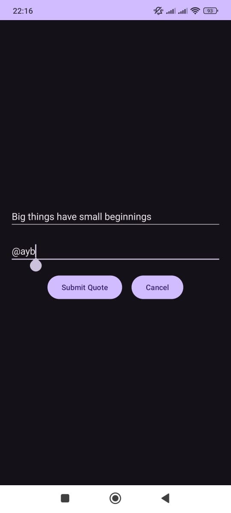
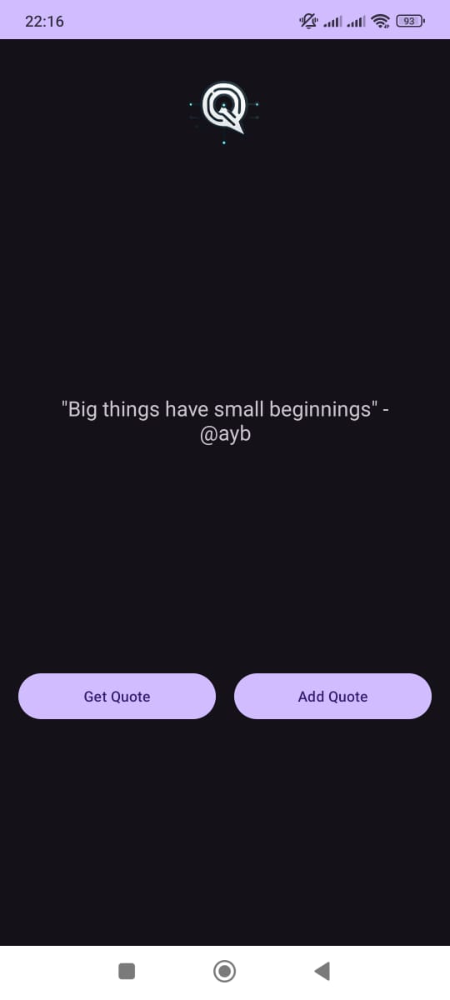

# Academic Project: Quote_G (Android App)

This project, part of our academic studies, is an Android application developed using **Java** and **XML**. It is a native app that allows users to:  

- **Create new quotes** with their authors.  
- **Retrieve random quotes** to inspire and motivate.

Below is a preview of the app's features:  

  
  

